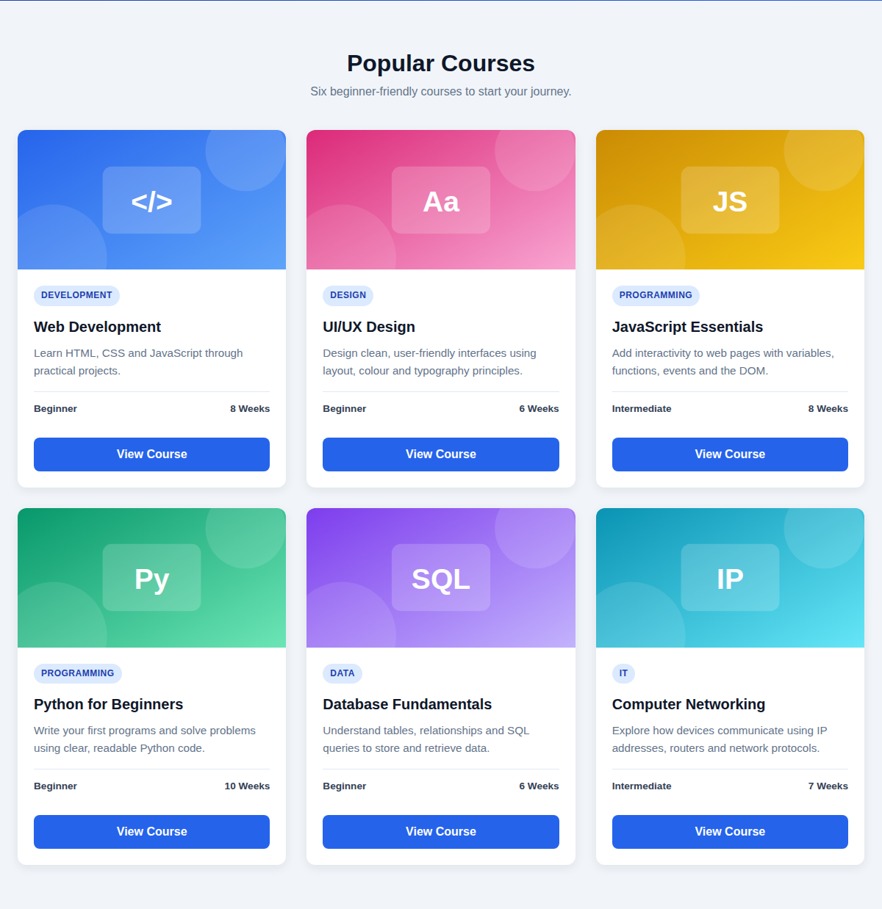
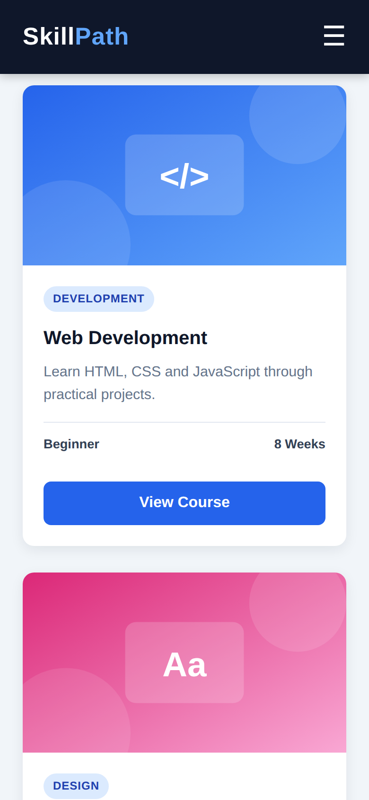
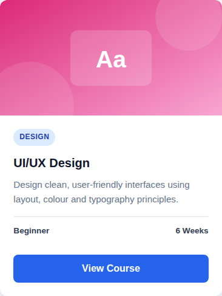
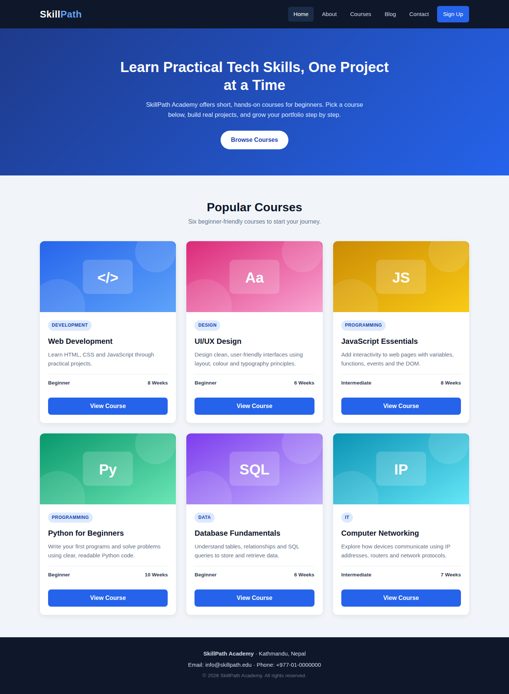

# HTML & CSS — Navigation Bar and Card Design

## 1. Assignment Title
**HTML & CSS — Navigation Bar and Responsive Card Layout (SkillPath Academy)**

## 2. Student Information
- **Name:** [Your Full Name]
- **Student ID:** [Your Student ID]
- **Course/Module:** [Course / Module Name]
- **Level:** [Level / Semester]
- **Assignment Title:** Building a Navigation Bar and Responsive Card Layout Using HTML & CSS

## 3. Project Description
This project is a small, single-page website for a fictional online learning platform called **SkillPath Academy**. It combines all four parts of the assignment into one consistent design:

- **Header / Navigation Bar** – brand name plus Home, About, Courses, Blog, Contact and a highlighted Sign Up button. Links have hover effects, and on small screens the menu collapses into a hamburger icon (built with a CSS-only checkbox toggle).
- **Main Section** – a hero area with a heading, short introduction and a call-to-action button.
- **Card Section** – six course cards. Each card has an image, category tag, title, short description, level and duration, and a "View Course" button. Cards lift and gain a deeper shadow on hover.
- **Footer** – academy name, location, contact details and copyright.

The card layout uses **CSS Grid** and adapts to screen size: 3 cards per row on desktop, 2 on tablet and 1 on mobile.

## 4. Technologies Used
- HTML5 (semantic elements)
- CSS3
- CSS Flexbox
- CSS Grid
- Responsive CSS (media queries)
- CSS custom properties (variables)

## 5. Learning Resources

| No. | Resource | Topic Learned | What I Learned | How I Applied It |
|---|---|---|---|---|
| 1 | Teacher's lecture/material | CSS Selectors | Element, class, descendant and pseudo-class selectors | Used class selectors (`.card`, `.nav-links`) and `:hover` for interactive states |
| 2 | University material | HTML Structure | Semantic HTML elements and page structure | Used `<header>`, `<nav>`, `<main>`, `<section>`, `<article>` and `<footer>` |
| 3 | YouTube tutorial (responsive navbar) | Navigation Bar | Flexbox alignment and a CSS-only hamburger menu | Applied `display: flex` and `justify-content: space-between` to the navbar; checkbox toggle for mobile menu |
| 4 | MDN Web Docs – CSS Grid & card layout example | CSS Layout | Grid layout with `grid-template-columns` and `gap` | Built the 3/2/1-column responsive card grid |
| 5 | MDN Web Docs – Box model | Box Model | How padding, border and margin add to element size; `box-sizing: border-box` | Applied a global `box-sizing` reset so card widths stay predictable |
| 6 | W3Schools – CSS media queries | Responsive Design | Writing breakpoints with `@media (max-width: …)` | Added tablet (992px) and mobile (768px) breakpoints |

**Detailed explanations**

1. **Teacher's lecture/material:** I learned the difference between element, class and pseudo-class selectors and why class selectors make styles reusable. I applied this by giving every card the same `.card` class so all six share one set of styles, and used `:hover` for the link, button and card effects.
2. **University material:** I learned that semantic elements describe the meaning of content, which helps accessibility and readability. I used `<nav>` for the menu instead of a plain `<div>`, `<article>` for each self-contained card, and `<main>`/`<footer>` for page regions.
3. **YouTube tutorial:** I learned how Flexbox aligns items horizontally and controls spacing between them. I applied `display: flex`, `justify-content: space-between` and `align-items: center` to place the brand on the left and links on the right, and used `gap` to space the links. I also learned how a hidden checkbox and `:checked ~` sibling selector can show/hide a mobile menu without JavaScript.
4. **MDN Web Docs (Grid / card layout):** I learned how `grid-template-columns: repeat(3, 1fr)` creates equal-width columns and how `gap` spaces cards evenly. I used Grid for the card section because it controls rows and columns together.
5. **MDN Web Docs (Box model):** I learned that, by default, padding and border are added to an element's width. Setting `box-sizing: border-box` on all elements kept my card and button sizes consistent.
6. **W3Schools (media queries):** I learned how to change styles at specific screen widths. I changed the grid to 2 columns at 992px and 1 column at 768px, and switched the navbar to a vertical, collapsible menu on mobile.

## 6. Screenshots

### Navigation Bar


### Card Design


### Card Layout


### Responsive Design


### Additional Screenshots





## 7. Key Concepts Learned
- **Semantic HTML:** Elements like `<header>`, `<nav>`, `<main>`, `<article>` and `<footer>` describe what content is, helping screen readers and making code easier to read than `<div>`-only markup.
- **CSS selectors:** Class selectors style many elements consistently; pseudo-classes like `:hover` and `:checked` style elements based on state.
- **Box model:** Every element is content + padding + border + margin. `box-sizing: border-box` makes width include padding and border.
- **Flexbox:** A one-dimensional layout tool, used for the navbar, card internals and the card meta row.
- **Grid:** A two-dimensional layout tool, used for arranging the six cards in rows and columns.
- **Typography:** A clean sans-serif font stack, a clear size hierarchy (h1 > h2 > h3 > body) and comfortable line-height.
- **Spacing:** Consistent padding, margins and `gap` values give the page a tidy, professional rhythm.
- **Hover effects:** `transition` with `transform: translateY()` and `box-shadow` creates smooth card lift effects.
- **Responsive design:** Media queries change the number of columns and the navigation style for tablet and mobile screens.

## 8. Challenges and Solutions
1. **Cards with different text lengths had uneven buttons.** Longer descriptions pushed the "View Course" button lower on some cards. I solved this by making the card and card body flex columns and giving the description `flex-grow: 1`, which pushes the meta row and button to the bottom so all cards line up.
2. **Navigation links did not fit on mobile screens.** The horizontal links overflowed on narrow screens. I solved it with a media query that hides the links and shows a hamburger icon; a hidden checkbox with the `:checked ~ .nav-links` selector reveals a vertical menu when tapped.
3. **Images stretched inside the cards.** Images with different proportions looked distorted. I fixed the image height at 190px and used `object-fit: cover` so images crop neatly instead of stretching, and `overflow: hidden` on the card keeps them inside the rounded corners.

## 9. AI Usage Disclosure
AI assistance (Claude by Anthropic) was used during this assignment to help draft code and documentation. I have reviewed, tested and understood all of the code and can explain every HTML element and CSS property used.
*(Edit this section to accurately describe how you used AI tools.)*

## 10. Project Structure
```
html-css-assignment/
├── index.html
├── css/
│   └── style.css
├── images/
│   ├── web-dev.svg
│   ├── ui-design.svg
│   ├── javascript.svg
│   ├── python.svg
│   ├── database.svg
│   └── networking.svg
├── screenshots/
│   ├── navigation-bar.png
│   ├── card-design.png
│   ├── card-layout.png
│   ├── responsive-design.png
│   ├── card-hover.png
│   ├── mobile-navigation.png
│   ├── tablet-layout.png
│   └── full-page-desktop.png
└── README.md
```

## 11. GitHub Repository
https://github.com/aayushchaudhary-123/html-css-assignment
